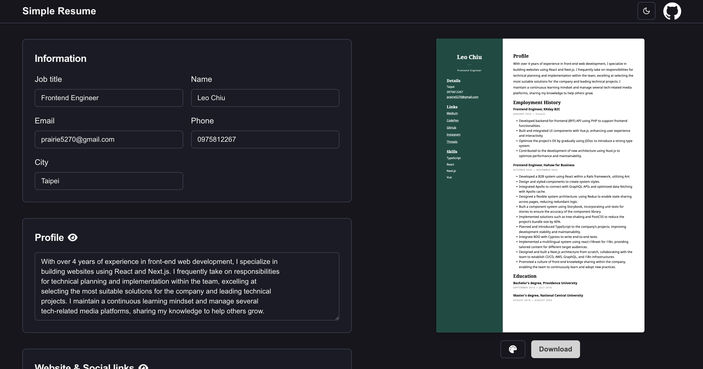

# Simple RESUME

A online tool to create a resume.

Online site: https://simple-resume-nu.vercel.app/resume-editor

## Features

- Create a resume easily.
- The resume data is stored in local storage.

## Tech Stack

- Next.js 14
- React 18
- Tailwind
- Shadcn UI
- react-pdf/renderer

## Local Development

1. Download the repo git clone `gh repo clone leochiu-a/simple-resume`
2. Change the directory cd `simple-resume`
3. Install the dependency `pnpm i`
4. Start a development server `pnpm dev`
5. Open your browser and visit http://localhost:3000/resume-editor
