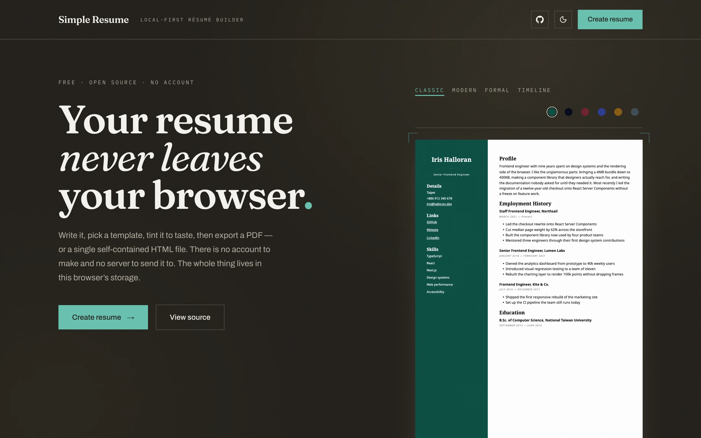

# Open Resume



A resume builder that never uploads your resume. There is no account to make and no server to send it
to — the resume lives in this browser's storage, and the AI that translates and rewrites it runs on
the device too, so that stays true with it switched on.

**Live at [open-resume-dev.vercel.app](https://open-resume-dev.vercel.app)** — nothing to install.

## What you can do

Write it, style it, export it.

1. **Write** your resume in a form that saves as you type. The grip on a section heading floats
   the running order over it, to drag into the shape you want.
2. **Style** it with one of [eight templates](#templates), tinted in a colour you pick.
3. **Export** it as a PDF, as a [standalone HTML file](#html-export), or
   [copy it as Markdown](#markdown-for-agents) to paste into an AI agent.

Three more things run on the browser's own model, and so keep the same promise:

- Keep the same resume in [two languages](#two-languages), translated on the device and corrected by
  hand.
- [Rewrite the profile or a role description](#rewriting-on-device), previewing the result before it
  replaces anything.
- Build the resume by talking to a browser agent, via [WebMCP](#webmcp-experimental).

Those three need Chrome 138+ or Edge 148+ on desktop. Everything else works anywhere — you just write
the second language yourself.

## Templates

The palette button floating over the preview opens the appearance panel: six preset swatches, a
custom colour picker behind **Custom…**, and thumbnails of the eight layouts rendered from your own
resume, at a size worth comparing. All eight render the same resume to all three outputs — the live
preview, the PDF, and the HTML export.

| Template     | Layout                                                                                              | The colour picker tints        |
| ------------ | --------------------------------------------------------------------------------------------------- | ------------------------------ |
| **Classic**  | Two columns, serif headings on a full-height colour sidebar                                         | the sidebar                    |
| **Modern**   | Two columns, tinted contact panel on the left, uppercase headings on hairline rules                 | the panel                      |
| **Formal**   | Single column, centered serif header over a dashed rule                                             | the name                       |
| **Timeline** | Banded header, 70/30 columns with the rail on the **right**, dated timeline entries and pill skills | the name and job titles        |
| **Ledger**   | Single column, section titles set in a left gutter with the content beside them                     | the titles and the header rule |
| **Banner**   | Single column under a full-width colour band carrying the header                                    | the band                       |
| **Compact**  | Dense single column, no sidebar, headings on ruled lines — the one that fits the most on a page     | the section titles             |
| **Dated**    | Single column with every entry's dates in a left margin, the entry beside them                      | the section titles             |

**[Adding a template, and the preview's @react-pdf pitfalls → docs/templates.md](docs/templates.md)**

## HTML export

**Download HTML** writes the same A4 layout as the PDF — for whichever template is selected — into a
single `resume.html`: one document, all CSS inlined, no build step and no assets to ship alongside
it. That makes it easy to host as a personal resume page, paste into an email, or keep under version
control as text. It renders correctly offline, stacks to one column on a narrow screen, and printing
it gives back a PDF.

## Markdown for agents

**Download → Copy as Markdown** puts the resume on the clipboard as Markdown. The PDF and the HTML
export are layouts — a model reading either has to recover the structure from position and type size
— whereas Markdown carries the same content as headings, lists and links, which is what an AI agent
(or any chat box you paste into) reads without a parser. It is the export for "here is my resume,
tailor it to this job".

It follows the preview rather than the storage shape: hidden sections are left out, empty fields
never become empty headings, dates render as `Jan 2018 — Jan 2020` (`Present` for an ongoing entry),
and job bullets become a list. Nothing lands on disk — the Markdown only ever exists on the
clipboard.

## Two languages

A resume can be kept in Chinese and in English at once. The tabs in the middle of the editor's bar
switch between them, and the dot marks the **original** — the one language everything else is a
translation of.

Only prose is translated: the wanted job, the city, the profile, job titles and descriptions,
schools, degrees and majors. Names, emails, phones, URLs, skills and company names are copied
verbatim, because a skill list through a translator turns TypeScript into 打字稿 and Google into
谷歌. When the original moves on, a panel at the top of the translated resume offers to update it,
re-translate from scratch, or swap which language is the original — and a field you rewrote yourself
is never quietly overwritten.

**[The `ResumeDoc` shape and how stale/edited are tracked → docs/on-device-ai.md](docs/on-device-ai.md)**

## Rewriting on-device

The wand beside **Profile** and beside each role's description opens advice on writing that section,
and offers to do it for you. Opening it costs nothing: the guidance is written down rather than
generated, so it is useful in a browser with no model at all. The model is reached only when one of
the three actions is pressed, and the result streams in as a draft — the field keeps what it has
until **Use this** is pressed, which is what makes trying an action safe.

**[Session handling and bullet round-tripping → docs/on-device-ai.md](docs/on-device-ai.md)**

## WebMCP (experimental)

The editor registers itself as a set of AI agent tools using
[WebMCP](https://webmachinelearning.github.io/webmcp/), so a browser agent can fill in the resume
instead of you typing into every field. Twelve tools cover reading the resume plus writing every
section — the header, the summary, skills, social links, employment history, education, and
per-section visibility. Then ask the agent something like:

> Read my resume, then rewrite the profile summary for a staff frontend role and add my job at Vercel
> from March 2020 to now.

WebMCP ships natively in Edge 147+. In Chrome 149 it is an origin trial; locally, open
`chrome://flags/#enable-webmcp-testing`, set it to **Enabled**, and relaunch. The sparkles button in
the editor's bar reports where you stand on its **Browser agent** row. WebMCP is a W3C Web Machine
Learning Community Group draft — not a standard, and still moving.

**[Full tool reference and conventions → docs/webmcp.md](docs/webmcp.md)**

## Built with

Next.js 16 (App Router), React 19, Tailwind, shadcn/ui, react-pdf/renderer, next-themes, and the
browser's built-in Translator and Prompt APIs. Playwright for the end-to-end suite; oxlint and oxfmt
for lint and format.

## Contributing

```bash
gh repo clone leochiu-a/open-resume
cd open-resume
pnpm i
pnpm dev          # then open http://localhost:3000/resume-editor
```

**[Commands, conventions, and the rules that must not be broken → AGENTS.md](AGENTS.md)**

## License

[MIT](LICENSE) © Leo Chiu
