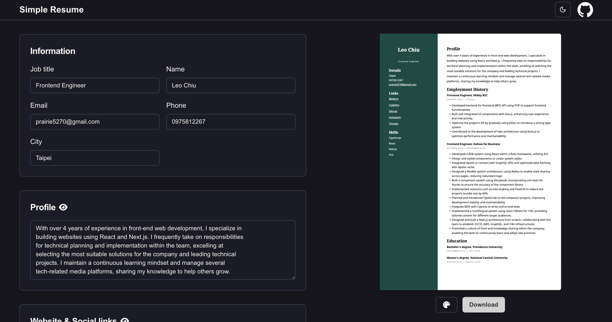

# Simple RESUME

A online tool to create a resume.

Online site: https://simple-resume-nu.vercel.app/resume-editor

## Features

- Create a resume easily.
- Pick between [two templates](#templates) and tint either one with the colour picker.
- Export the resume as a PDF, or as a [standalone HTML file](#html-export).
- The resume data is stored in local storage.
- Build the resume by talking to a browser AI agent, via [WebMCP](#webmcp-experimental).

## Tech Stack

- Next.js 14
- React 18
- Tailwind
- Shadcn UI
- react-pdf/renderer

## Local Development

1. Download the repo git clone `gh repo clone leochiu-a/simple-resume`
2. Change the directory cd `simple-resume`
3. Install the dependency `pnpm i`
4. Start a development server `pnpm dev`
5. Open your browser and visit http://localhost:3000/resume-editor

## Templates

The button to the left of the colour picker switches between two layouts:

- **Classic** — serif headings against a full-height colour sidebar.
- **Modern** — two columns, a tinted contact panel on the left, and uppercase letterspaced
  headings sitting on hairline rules.

Both render the same resume to all three outputs: the live preview, the PDF, and the standalone
HTML export. The colour picker tints the sidebar in Classic and the contact panel in Modern, so
switching template resets the colour to that template's own default rather than carrying over a
choice made for the other. Modern flips its own text between ink and white depending on how dark
the picked colour is, so the panel stays readable at either end.

A template owns both of its renderers and is registered in one place —
[`registry.tsx`](src/app/resume-editor/components/template/registry.tsx) — so adding a third means
adding a `Document` component, an HTML builder, and a single entry. Coverage lives in
[`e2e/template-picker.spec.ts`](e2e/template-picker.spec.ts).

One thing to know before writing a template: the preview does not rasterise the PDF. It renders the
very same @react-pdf element tree into an iframe, where the primitives land as unknown DOM elements
(`<VIEW>`, `<TEXT>`) and their style objects are applied as plain CSS. That makes the preview cheap
and instant, but it means sizes need explicit units (`"11.19pt"`, not `11.19`), every flex container
has to spell out `display: "flex"`, and `Svg` draws nothing. See
[`units.ts`](src/app/resume-editor/components/template/modern/units.ts) and
[`contact-icons.tsx`](src/app/resume-editor/components/template/modern/contact-icons.tsx) for how the
Modern template works within that.

## HTML export

**Download HTML** writes the same A4 layout as the PDF — for whichever template is selected — into a
single `resume.html` file: one
document, all CSS inlined, no build step and no assets to ship alongside it. That makes it easy to
host as a personal resume page, paste into an email, or keep under version control as text.

The only external reference is the Google Fonts stylesheet for Noto Sans/Noto Serif; every family
falls back to a system stack, so the file still renders correctly offline. The layout stacks the
sidebar above the content below 700px, and `@media print` restores the A4 sheet — printing the
exported file gives back a PDF.

The builder lives in
[`build-resume-html.ts`](src/app/resume-editor/components/template/build-resume-html.ts), with
coverage in [`e2e/html-export.spec.ts`](e2e/html-export.spec.ts).

## WebMCP (experimental)

The editor registers itself as a set of AI agent tools using
[WebMCP](https://webmachinelearning.github.io/webmcp/), so a browser agent can fill in the resume
instead of the user typing into every field. WebMCP is a W3C Web Machine Learning Community Group
draft — it is not a W3C Standard and the API is still moving.

Twelve tools cover reading the resume plus writing every section — the header, the summary, skills,
social links, employment history, education, and per-section visibility.

WebMCP ships in Edge 147+, and in Chrome behind a flag: open `chrome://flags/#enable-webmcp-testing`,
set it to **Enabled**, and relaunch. The nav bar shows an **Agent ready** badge when registration
succeeded, and **Agent unavailable** when the browser has no WebMCP support. Then ask the agent
something like:

> Read my resume, then rewrite the profile summary for a staff frontend role and add my job at Vercel
> from March 2020 to now.

**[Full tool reference and conventions → docs/webmcp.md](docs/webmcp.md)**

Automated coverage lives in [`e2e/webmcp.spec.ts`](e2e/webmcp.spec.ts), which stubs
`document.modelContext` so the tools can be exercised in plain Chromium.
